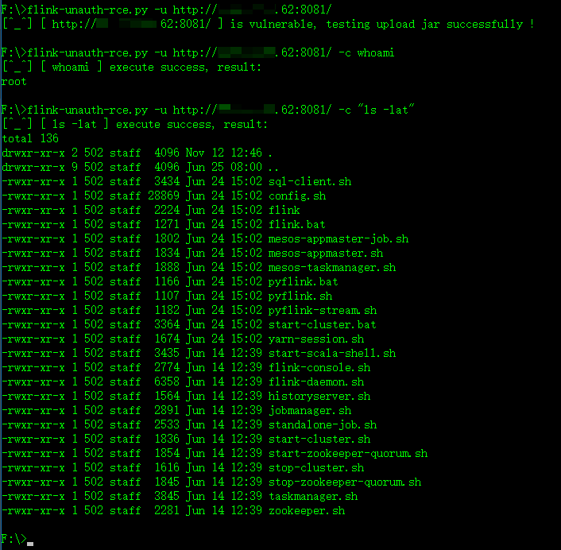

# flink-unauth-rce
exploit flink unauth rce on right way by python2 scripts

**snapshot**




**usage**

```python
# python2 flink-unauth-rce.py -h

usage: flink-unauth-rce.py [-h] [-u URL] [-c COMMAND] [--delete]
                           [--proxy PROXY]

optional arguments:
  -h, --help     show this help message and exit
  -u URL         such as: http://127.0.0.1:8081
  -c COMMAND     command that your will execute on target
  --delete       delete jar after execute command
  --proxy PROXY  request http/https proxy

```
